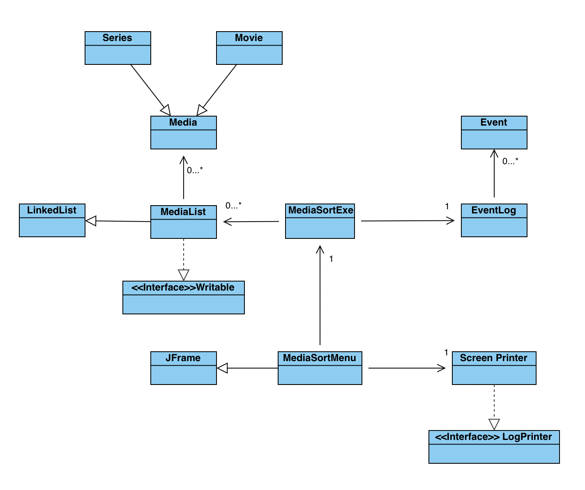

# Movie/Series Sorter

## Task 1:
My application will be used by people looking to compare series and movies which they have both seen or like in order to see a match for what they could watch together. The application itself will take a list of series/ movies input by the users adn will compare the two lists to see which series match. It would also sort through them since the user could add the genre and then display all series of x genre if there are no matches. This project is of interest for me since I do struggle finding things to watch when I'm with people and we end up not being able to decide what to watch. This would simplify that process.

##**User Stories:**
- As a user, I want to be able to add series to a list
- As a user, I want to be able to remove series from a list
- As a user, I want to be able to add movie to a list
- As a user, I want to be able to remove movie from a list
- As a user, I want to be able to create multiple lists
- As a user, I want to be able to switch between lists
- As a user, I want to be able to list all created lists
- As a user, I want to be able to list all media in a specific list
- As a user, I want to be able to put series or movies into their respective genres
- As a user, I want to be able to compare series or movies with someone else
- As a user, I want to be able to see series or movies in a genre

## **Phase 4:**

## Task 2:

Thu Mar 31 19:15:10 PDT 2022
Added test loaded from data
Thu Mar 31 19:15:10 PDT 2022
Test List loaded from data
Thu Mar 31 19:15:20 PDT 2022
My new List was created
Thu Mar 31 19:16:08 PDT 2022
My new List was selected
Thu Mar 31 19:16:08 PDT 2022
Added series to My new List
Thu Mar 31 19:16:08 PDT 2022
Added movie to My new List
Thu Mar 31 19:16:08 PDT 2022
Added movie to My new List
Thu Mar 31 19:16:21 PDT 2022
My new List was selected
Thu Mar 31 19:16:35 PDT 2022
My new List was selected
Thu Mar 31 19:16:35 PDT 2022
My new List was selected
Thu Mar 31 19:16:35 PDT 2022
Removed series from My new List
Thu Mar 31 19:16:35 PDT 2022
Removed movie from My new List
Thu Mar 31 19:16:35 PDT 2022
Removed movie from My new List

*Task 3*

I would not do any refactoring as this is as clean as my tree can get with the different types of media that I have